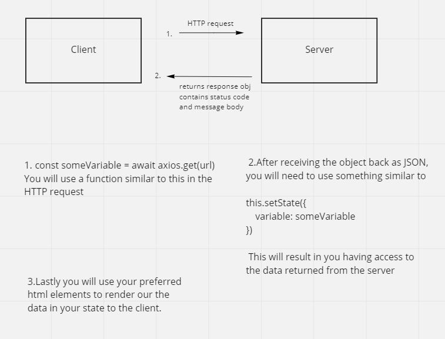
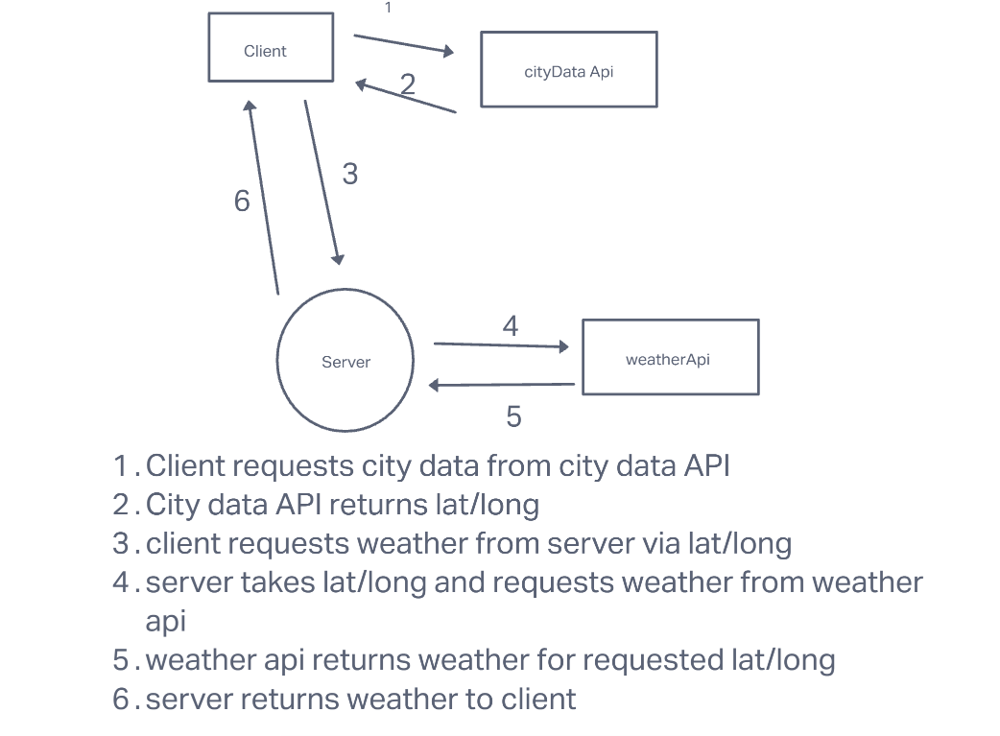
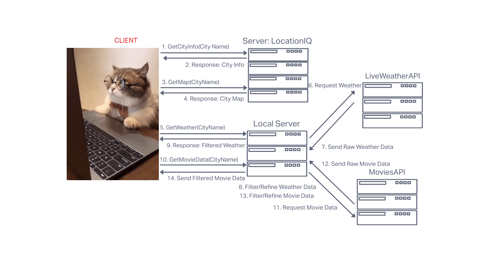

# City Explorer

**Author**: Brady Davenport

**Version**: 0.1.0

## Overview
<!-- Provide a high level overview of what this application is and why you are building it, beyond the fact that it's an assignment for this class. (i.e. What's your problem domain?) -->

## Getting Started
<!-- What are the steps that a user must take in order to build this app on their own machine and get it running? -->

## Architecture
<!-- Provide a detailed description of the application design. What technologies (languages, libraries, etc) you're using, and any other relevant design information. -->

## Change Log
<!-- Use this area to document the iterative changes made to your application as each feature is successfully implemented. Use time stamps. Here's an example:

01-01-2001 4:59pm - Application now has a fully-functional express server, with a GET route for the location resource. -->

### Lab 06

#### 16 May 2022

##### Name of feature: Set up

Estimate of time needed to complete: 30 mins

Start time: 2:30

Finish time: 3:30

Actual time needed to complete: 1 hr

##### Name of feature: Locations

Estimate of time needed to complete: 1.5 hours

Start time: 3:45

Finish time: 6:11

Actual time needed to complete: 2 hrs 26mins

#### 17 May 2022

##### Name of feature: Map

Estimate of time needed to complete: 1 hour

Start time: 12:50

Finish time: 1:40

Actual time needed to complete: 50 mins

##### Name of feature: Error

Estimate of time needed to complete: 45 mins

Start time: 3:21

Finish time: 4:06

Actual time needed to complete: 45 mins

### Lab 07

Name of feature: Weather

Estimate of time needed to complete: 1.5 hours

Start time: 4:30

Finish time: 6:15

Actual time needed to complete: 1hr 45mins

## Lab 08 18 May 2022

Name of feature: Movies

Estimate of time needed to complete:

Start time:

Finish time:

Actual time needed to complete:

<!-- ## Lab 09 1 May 2022

Name of feature:

Estimate of time needed to complete:

Start time:

Finish time:

Actual time needed to complete:

## Credit and Collaborations -->

<!-- ## Lab 10 1 May 2022

Name of feature:

Estimate of time needed to complete:

Start time:

Finish time:

Actual time needed to complete: -->

## Credit and Collaborations

Lab 06 Web Request Response Cycle - Collaborated with [Cody Davis](https://github.com/Cozhee/)

Lab 07 Web Request Response Cycle - Collaborated with [Dylan Ullrich](https://github.com/GetUllrichorDieTrying)

This project was bootstrapped with [Create React App](https://github.com/facebook/create-react-app).
